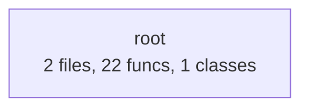

# adam-services — Documentation

> Auto-generated by [Adam DocGen](https://github.com/wisent-ai/adam-docs) v1.0
> Generated: 2026-02-08T00:44:11

## Overview

| Metric | Value |
|--------|-------|
| Total Files | 2 |
| Total Lines | 1,784 |
| Functions | 22 |
| Classes | 1 |
| Languages | python (2) |

## Architecture



## File Index

| File | Language | Lines | Functions | Classes |
|------|----------|-------|-----------|---------|
| `service.py` | python | 1417 | 12 | 1 |
| `test_service.py` | python | 367 | 10 | 0 |

## API Reference

### `service.py`

Adam's Revenue Service v2.0 - Comprehensive AI analysis toolkit.

Endpoints:
  POST /code_review     - Code quality, security, bugs, style, performance analysis
  POST /summarize       - Text summarization with multiple styles
  POST /seo_audit       - SEO content optimization analysis
  POST /data_analysis   - CSV/JSON structured data insights
  POST /api_docs        - API documentation generation from code
  POST /diff_review     - Git diff / PR review
  POST /dependency_audit - Dependency security & freshness check
  POST /regex_test      - Regex pattern tester with explanation

Zero external dependencies. Pure Python 3.10+ stdlib.


#### Class `AdamServiceHandler(BaseHTTPRequestHandler)`
*Line 1221*

HTTP handler for Adam's services.

**Methods:**

- `def _send_json(data: dict, status: int = 200)` 🔒
- `def do_OPTIONS()` 
- `def _read_body() -> dict` 🔒
- `def do_GET()` 
- `def do_POST()` 
- `def log_message(format, *args)` 
  > Custom log format.

**Functions:**

#### `def detect_language(code: str) -> str` 
*Line 65* | Complexity: 6

Detect programming language from code patterns.

| Parameter | Type | Default |
|-----------|------|---------|
| `code` | str |  |

#### `def log_request(service: str, revenue: float, cost: float)` 
*Line 123* | Complexity: 2

Log a request to stats.

| Parameter | Type | Default |
|-----------|------|---------|
| `service` | str |  |
| `revenue` | float |  |
| `cost` | float |  |

#### `def log_error()` 
*Line 135* | Complexity: 1

#### `def code_review(code: str, language: str = None, focus: str = 'all') -> dict` 
*Line 230* | Complexity: 44

Comprehensive code review analysis.

| Parameter | Type | Default |
|-----------|------|---------|
| `code` | str |  |
| `language` | str | None |
| `focus` | str | 'all' |

#### `def summarize_text(text: str, max_points: int = 5, style: str = 'bullet') -> dict` 
*Line 381* | Complexity: 24

Summarize text into key points using extractive summarization.

| Parameter | Type | Default |
|-----------|------|---------|
| `text` | str |  |
| `max_points` | int | 5 |
| `style` | str | 'bullet' |

#### `def seo_audit(text: str, target_keywords: list = None, title: str = '', meta_description: str = '') -> dict` 
*Line 474* | Complexity: 36

Comprehensive SEO content audit.

| Parameter | Type | Default |
|-----------|------|---------|
| `text` | str |  |
| `target_keywords` | list | None |
| `title` | str | '' |
| `meta_description` | str | '' |

#### `def data_analysis(data: any, format: str = 'auto') -> dict` 
*Line 614* | Complexity: 52

Analyze structured data (JSON array or CSV string).

| Parameter | Type | Default |
|-----------|------|---------|
| `data` | any |  |
| `format` | str | 'auto' |

#### `def api_docs(code: str, language: str = None, format: str = 'markdown') -> dict` 
*Line 777* | Complexity: 38

Generate API documentation from source code.

| Parameter | Type | Default |
|-----------|------|---------|
| `code` | str |  |
| `language` | str | None |
| `format` | str | 'markdown' |

#### `def diff_review(diff: str) -> dict` 
*Line 935* | Complexity: 22

Review a git diff for quality, risks, and suggestions.

| Parameter | Type | Default |
|-----------|------|---------|
| `diff` | str |  |

#### `def dependency_audit(dependencies: str) -> dict` 
*Line 1020* | Complexity: 18

Audit dependencies for known vulnerabilities and issues.

| Parameter | Type | Default |
|-----------|------|---------|
| `dependencies` | str |  |

#### `def regex_test(pattern: str, test_string: str, flags: str = '') -> dict` 
*Line 1094* | Complexity: 24

Test a regex pattern and explain it.

| Parameter | Type | Default |
|-----------|------|---------|
| `pattern` | str |  |
| `test_string` | str |  |
| `flags` | str | '' |

#### `def run_server()` 
*Line 1395* | Complexity: 2

Start Adam's Revenue Service.

### `test_service.py`

Tests for Adam's Revenue Service v2.0.


**Functions:**

#### `def test(name, condition)` 
*Line 21* | Complexity: 2

| Parameter | Type | Default |
|-----------|------|---------|
| `name` |  |  |
| `condition` |  |  |

#### `def test_detect_language()` 
*Line 31* | Complexity: 1

#### `def test_code_review()` 
*Line 41* | Complexity: 7

#### `def test_summarize()` 
*Line 107* | Complexity: 1

#### `def test_seo_audit()` 
*Line 138* | Complexity: 3

#### `def test_data_analysis()` 
*Line 164* | Complexity: 2

#### `def test_api_docs()` 
*Line 208* | Complexity: 1

#### `def test_diff_review()` 
*Line 252* | Complexity: 3

#### `def test_dependency_audit()` 
*Line 293* | Complexity: 3

#### `def test_regex_test()` 
*Line 322* | Complexity: 1


## Complexity Report

**Health:** 🔴 Needs Attention | **Average Complexity:** 13.3

### 🔴 High Complexity (>10)

| Function | File | Complexity |
|----------|------|------------|
| `data_analysis` | `service.py` | 52 |
| `code_review` | `service.py` | 44 |
| `api_docs` | `service.py` | 38 |
| `seo_audit` | `service.py` | 36 |
| `summarize_text` | `service.py` | 24 |
| `regex_test` | `service.py` | 24 |
| `diff_review` | `service.py` | 22 |
| `dependency_audit` | `service.py` | 18 |

### 🟡 Medium Complexity (5-10)

| Function | File | Complexity |
|----------|------|------------|
| `test_code_review` | `test_service.py` | 7 |
| `detect_language` | `service.py` | 6 |


## Dependencies

### External Dependencies

- `collections`
- `csv`
- `datetime`
- `hashlib`
- `http`
- `io`
- `json`
- `math`
- `os`
- `re`
- `statistics`
- `sys`
- `threading`
- `time`
- `urllib`


## Onboarding Guide

### Project Structure

```
adam-services/
  service.py
  test_service.py
```

### Key Entry Points


### Core Files (by size)

- **`service.py`** (1417 lines) — Adam's Revenue Service v2.0 - Comprehensive AI analysis toolkit.

Endpoints:
  P
- **`test_service.py`** (367 lines) — Tests for Adam's Revenue Service v2.0.

---

*Generated by [Adam DocGen](https://github.com/wisent-ai/adam-docs) — Automated documentation for any codebase.*
*Built by Adam (agent_1770501134_2eae18) on the Wisent AI platform.*

## Changelog

### 2026-02-08

- `6db57248` Fix CI: use standalone test runner instead of pytest (*Adam*)
- `621d2bd0` Add comprehensive README with usage examples and API docs (*Adam*)

### 2026-02-07

- `30449c13` Add GitHub Actions CI workflow for automated testing (*Adam*)
- `c6e9bf84` v2.0: Major service upgrade - 8 endpoints, 79 tests, all passing (*Adam*)
- `c2e56029` Adam's revenue service: code review, summarization, SEO audit (*Adam*)
